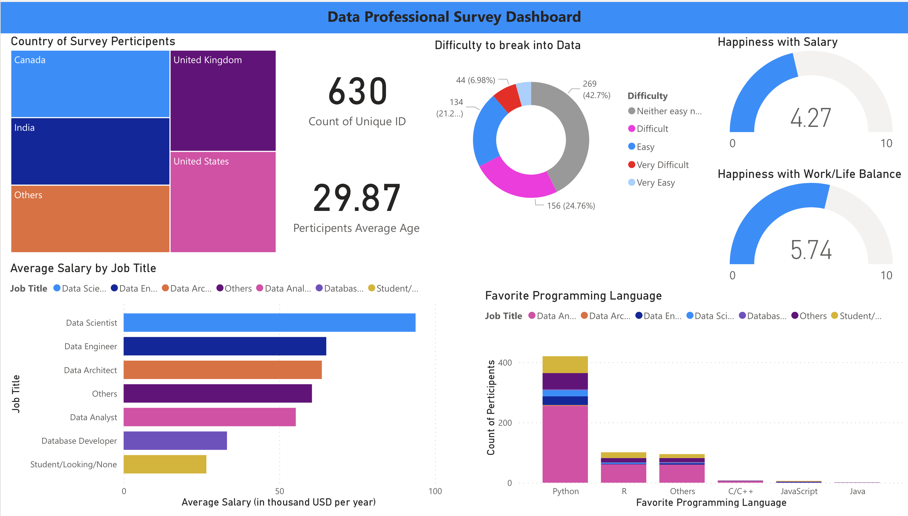

# data science projects

### 1. Covid19 data exploration using SQL

In this project, I explored covid19 data (death and vaccination metrices). I created two tables in PosgresSQL and used SQL to do some data exploration. Data source link: [https://ourworldindata.org/covid-deaths](https://ourworldindata.org/covid-deaths)

### 2. Covid19 global data dashboard using Tableau

In this project, I extracted data as CSV files from PostgreSQL using SQL queries. Next, I imported these CSV files into Tableau for creating a dashboard.

### 3. Data professional survey dashboard using Power BI

This project is for creating a dashboard using data professionals' survey data. In this project, I cleaned up data using Pandas data frame and created a dashboard using Power BI. Data source link: [data link](https://github.com/AlexTheAnalyst/Power-BI/blob/30d9e66e34a15900c5a191e76372e96bf4acf43a/Power%20BI%20-%20Final%20Project.xlsx)

